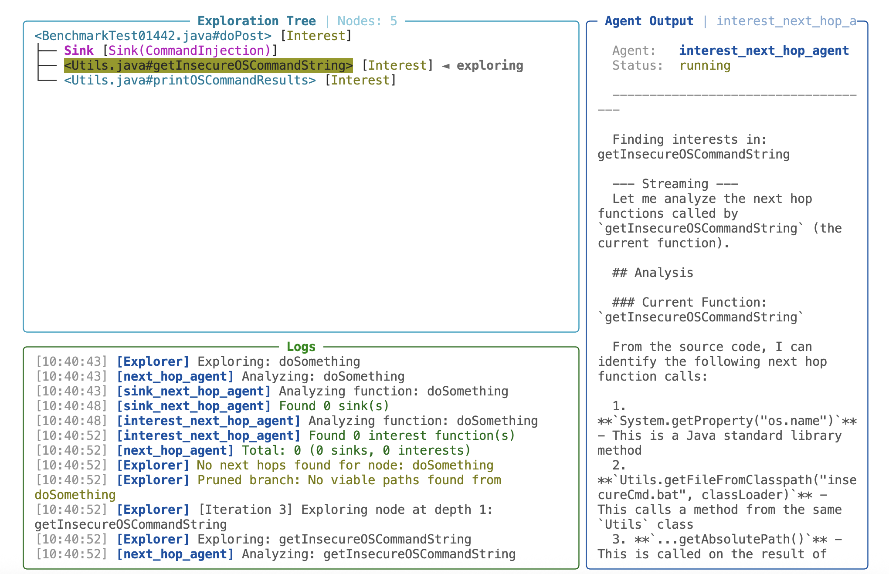
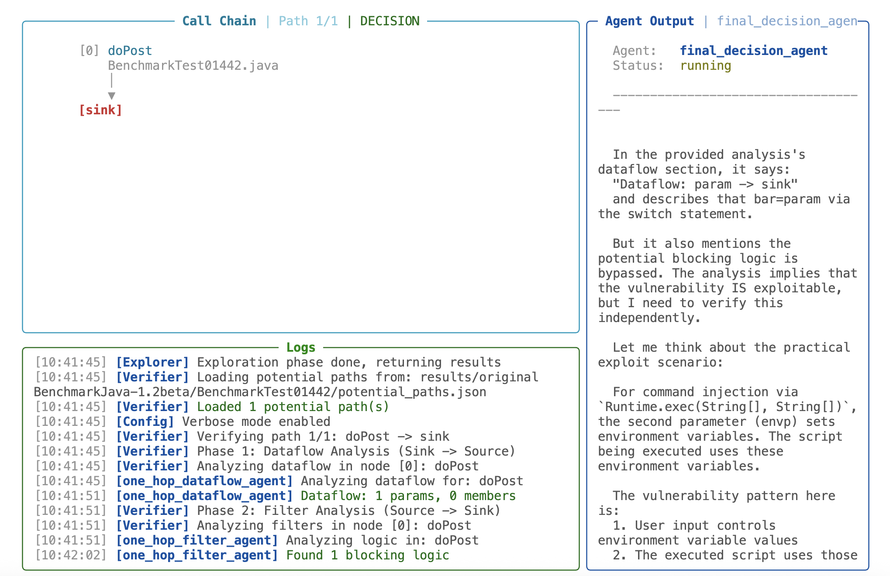

English | [中文](./README_CN.md)

# VulSolver

Large Language Models (LLMs) are being explored for vulnerability discovery because of their ability to understand code semantics—a capability lacking in traditional Static Application Security Testing (SAST) tools. A typical approach centers on constructing LLM-based agents, where the LLM acts as a brain, orchestrating tools and knowledge to identify vulnerabilities. However, this paradigm suffers from critical instability and inaccuracy due to LLMs' unpredictable outputs and severely degraded accuracy when processing large codebases. Certain approaches are SAST-centric, using LLMs to generate rules or validate alerts. While these approaches are more stable, they remain confined by SAST's inherent limitations and cannot fully leverage LLMs' semantic comprehension.

Inspired by how human experts conduct security audits, we introduce VulSolver—a novel paradigm for LLM-driven vulnerability detection that differs from all existing approaches. VulSolver incrementally builds and actively reuses verified security conclusions during analysis through a controlled process. This frees the LLM from repeatedly re-examining or memorizing previous code while maintaining full contextual awareness, leading to a dramatic increase in both stability and accuracy.

Experiments demonstrate the exceptional performance of VulSolver in identifying vulnerabilities across multiple metrics. Specifically, VulSolver achieves the following results on the OWASP Benchmark (https://github.com/OWASP-Benchmark/BenchmarkJava) on Path Traversal, Command Injection, and SQL Injection vulnerabilities (1,023 test cases in total):

| Vulnerability Type | Accuracy | Precision | Recall | F1-Score |
| :--- | :--- | :--- | :--- | :--- |
| Overall | 99.12% | 99.81% | 98.49% | 0.9915 |
| Command Injection | 98.41% | 100.00% | 96.83% | 0.9839 |
| Path Traversal | 98.88% | 100.00% | 97.74% | 0.9886 |
| SQL Injection | 99.60% | 99.63% | 99.63% | 0.9963 |

VulSolver currently supports detection of Path Traversal, Command Injection, Code Injection, and SQL Injection vulnerabilities, with ongoing development to expand coverage for additional vulnerability types.

# Installation and Configuration

Install the required dependencies with the following command:

```bash
pip install -r requirements.txt
```

Then configure the model settings in `config.yaml`:

```
llm:
  base_url: "your_base_url"
  api_key: "your_api_key"
  model: "your_model_name"
```

> Since VulSolver is currently built on the Claude Code SDK for agent orchestration, please ensure your `base_url` supports the Anthropic API format.

# Usage

VulSolver performs in-depth code analysis at the interface level (HTTP endpoints, RPC entry points, etc.). You can analyze a project's interface with the following command:

```python
python3 main.py <target_project_root_directory> <target_interface_name> # Example: python3 main.py '/tmp/helloProject' '/sample/hello'
```

During execution, VulSolver displays the analysis process in real-time via a TUI interface:

<table>
  <tr>
    <td></td>
    <td></td>
  </tr>
</table>

Upon completion, VulSolver will display a summary in the terminal.

# Viewing Results

After execution, you can find the result files `potential_paths.json` and `verified_paths.json` in the `results/<project_name>/<interface_name>` directory under the VulSolver root. The former records potential vulnerability call chains starting from the given interface, while the latter details whether each call chain contains a vulnerability and the locations of any logic that may prevent exploitation. Specifically, the contents of these files are as follows:

potential_paths.json:

```json
[
  {
    "InterfaceName": <analyzed_interface_name>,
    "Type": <vulnerability_type>,
    "SinkExpression": <sink_expression>,
    "Path": [
      {
        "file": <function_node_file_path>,
        "name": <function_node_name>,
        "source_code": <function_node_source_code>
      },
      <other nodes in the call chain, same format as above>
    ]
  },
  <other call chains, same format as above>
]
```

verified_paths.json:

```json
[
  {
    "InterfaceName": <analyzed_interface_name>,
    "Type": <vulnerability_type>,
    "SinkExpression": <sink_expression>,
    "Path": [
      {
        "file": <function_node_file_path>,
        "name": <function_node_name>,
        "source_code": <function_node_source_code>
      },
      <other nodes in the call chain, same format as above>
    ],
    "IsVulnerable": <whether_vulnerable>,
    "Confidence": <confidence_level>,
    "Summary": <analysis_summary>,
    "DataflowAnalysis": [
      {
        "NodeIndex": 0,
        "NodeName": <function_node_name>,
        "Parameters": <list_of_parameters_that_flow_to_sink>,
        "MemberVariables": <list_of_member_variables_that_flow_to_sink>
      },
      <dataflow information for other function nodes>
    ],
    "FilterLogics": [
      {
        "Dataflow": <dataflow_transmission_context>,
        "Description": <logic_description>,
        "File": <file_containing_the_logic>,
        "Lines": <lines_of_the_logic>
      },
      <other logics that may prevent exploitation>
    ]
  },
  <analysis results for other call chains, same format as above>
]
```

# Viewing Logs

After execution, you can find the log files `path_explore.log` and `path_verify.log` in the `logs/<project_name>/<interface_name>` directory under the VulSolver root. Both files record the detailed analysis process of VulSolver. The `path_explore.log` contains the detailed interface exploration process, with an exploration tree displayed at the end showing paths from the interface to various sinks, for example:

```
<VulSolver exploration tree building process>

BenchmarkTest00011.java#doPost
    ├── Sink
    └── Sink
```

The `path_verify.log` records the detailed verification process for call chains extracted from the exploration tree. Each entry begins with the call chain header, followed by the complete verification process:

```
Type: PathTraversal
Sink Expression: new java.io.File(param, "/Test.txt")

Call Chain:
  doPost → sink

Path Nodes:
  [0] doPost
      File: BenchmarkTest00011.java

<VulSolver verification process for this call chain>
```

# Integration with SAST

VulSolver consists of two modules—`path_explore` and `path_verify`. The former discovers call chains, while the latter verifies them. If you find that certain SAST tools have strong vulnerability detection capabilities but suffer from high false positive rates, you can combine SAST with VulSolver by using SAST to replace the `path_explore` module, and leveraging `path_verify` to further validate SAST alerts.

To do this, format your SAST alerts according to the `potential_paths.json` structure described above, then run the following command to verify the paths using VulSolver:

```bash
python3 -m path_verify.verify <target_project_root_directory> <path_to_potential_paths.json>
```
